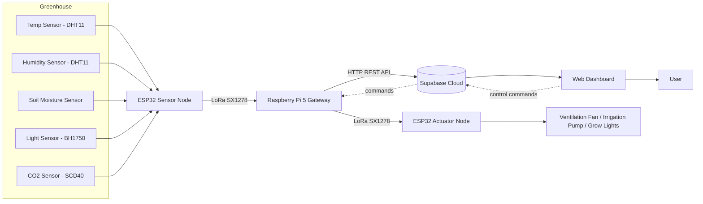

# Energy_Efficient_An_IoT_Based_Smart_GreenHouse_Monitoring_And_Control_System
# 🌱 Smart Greenhouse Environment Monitoring and Control System

An IoT-based greenhouse monitoring and control system that automates the measurement and regulation of key environmental parameters — temperature, humidity, soil moisture, light intensity, and CO₂ — using long-range LoRa communication, a Raspberry Pi gateway, and a real-time cloud dashboard.

<p align="center">
  
  
  
  
</p>

---

## 📖 Overview

Manual monitoring of greenhouse conditions is labour-intensive, inconsistent, and difficult to scale. This project replaces manual checks with an automated, low-power, long-range IoT pipeline: environmental sensors feed an ESP32 sensor node, data travels over LoRa to a Raspberry Pi gateway, gets stored in the Supabase cloud, and is visualized in real time on a web dashboard — which can also send control commands back to actuators (ventilation fan, irrigation pump, and lighting).

The system was designed and built as part of the **Project Based Learning (0701230605)** course, Department of Electronics and Telecommunication Engineering, **Symbiosis Institute of Technology, Pune**.

## ✨ Features

- 📡 **Long-range wireless sensing** via SX1278 LoRa modules (low power, large coverage vs. Wi-Fi)
- 🌡️ **Multi-parameter monitoring**: temperature, humidity, soil moisture, light intensity, and CO₂ concentration
- ☁️ **Cloud integration** with Supabase using REST APIs (HTTP POST for sensor data, HTTP GET for control commands)
- 📊 **Real-time dashboard** (Figma-designed) with live readings, historical trends (24h / 7d / 30d / all-time), min/avg/max stats, and out-of-range alerts
- 🎛️ **Dual control modes** — automatic threshold-based control and manual override from the dashboard
- 🔋 **Energy-efficient sensor node** using ESP32 deep sleep mode to extend battery life
- 🏗️ **Physical prototype** built with an acrylic enclosure housing sensors, actuators, and wiring

## 🏛️ System Architecture



**Data flow:**
1. The ESP32 **sensor node** reads temperature, humidity, soil moisture, light intensity, and CO₂ from the connected sensors.
2. Readings are transmitted wirelessly over **LoRa (SX1278)** to a **Raspberry Pi 5 gateway**.
3. The gateway pushes data to **Supabase** via HTTP POST and polls it via HTTP GET for pending control commands.
4. The **web dashboard** visualizes live and historical data and lets users trigger manual actions.
5. Control commands flow back through the gateway over LoRa to the **ESP32 actuator node**, which drives the ventilation fan, irrigation pump, and lighting via a relay module.

## 🛠️ Tech Stack & Hardware

| Component | Details |
|---|---|
| Microcontroller | ESP32 (sensor node + actuator node) |
| Gateway | Raspberry Pi 5 |
| Wireless Communication | SX1278 LoRa module, 433 MHz, SPI |
| Temperature & Humidity | DHT11 |
| Light Intensity | BH1750 (I²C, 1–65535 lux) |
| Soil Moisture | Analog soil moisture sensor (3.3–5V) |
| CO₂ | SCD40 (I²C, 400–5000 ppm) |
| Actuators | Ventilation fan, irrigation pump, grow lights (via relay module) |
| Cloud / Backend | Supabase (real-time database + REST API) |
| Dashboard | Figma-designed web UI |
| Enclosure | Acrylic sheet model (~20 × 15 × 15 in) |

## 📊 Dashboard Preview

The dashboard includes four main sections:

- **Dashboard** — live parameter cards (temperature, humidity, soil moisture, light intensity, CO₂) with optimal-range bars and High/Low/Normal status badges, plus an overall system status indicator
- **Controls** — toggle switches for ventilation fan, water pump, and grow lights, with quick actions ("Cool Down", "Water Now") and a "Turn Off All" option
- **Analytics & History** — historical trend charts (24 Hours / 7 Days / 30 Days / All Time) with min/avg/max summaries and data export
- **Alerts** — notifications when parameters fall outside optimal ranges

## 📁 Repository Structure

```
smart-greenhouse-monitoring/
├── firmware/
│   ├── sensor_node/         # ESP32 sensor node code (sensor reads + LoRa TX + deep sleep)
│   └── actuator_node/       # ESP32 actuator node code (LoRa RX + relay control)
├── gateway/
│   └── raspberry_pi/        # LoRa RX, Supabase REST API integration (POST/GET)
├── dashboard/
│   └── web-app/             # Dashboard frontend (Figma export / web implementation)
├── hardware/
│   ├── schematics/          # Wiring diagrams
│   └── enclosure/           # Acrylic model design files
├── docs/
│   ├── report.pdf           # Full project report
│   ├── presentation.pptx    # Final review presentation
│   └── datasheets/          # Component datasheets
└── README.md
```

> Adjust this structure to match how your code is actually organized in the repo.

## 🚀 Getting Started

### Prerequisites
- Arduino IDE / PlatformIO (for ESP32 firmware)
- Python 3.x (for Raspberry Pi gateway script)
- A Supabase project (URL + API key)
- LoRa SX1278 modules, ESP32 boards, Raspberry Pi 5, and the sensors/actuators listed above

### Setup

1. **Clone the repository**
   ```bash
   git clone https://github.com/<your-username>/smart-greenhouse-monitoring.git
   cd smart-greenhouse-monitoring
   ```

2. **Flash the sensor node**
   - Open `firmware/sensor_node/` in Arduino IDE
   - Update Wi-Fi/LoRa pin config and sensor calibration values
   - Flash to the ESP32 connected to the sensors

3. **Flash the actuator node**
   - Open `firmware/actuator_node/` in Arduino IDE
   - Flash to the ESP32 connected to the relay module and actuators

4. **Set up the Raspberry Pi gateway**
   ```bash
   cd gateway/raspberry_pi
   pip install -r requirements.txt
   ```
   - Add your Supabase URL and API key to the config/environment file
   - Run the gateway script to start receiving LoRa data and syncing with the cloud

5. **Run the dashboard**
   - Deploy `dashboard/web-app/` (or open the Figma prototype) and connect it to your Supabase instance

## 📈 Results

- Stable, packet-loss-free point-to-point LoRa communication between the sensor node and gateway, verified via RSSI monitoring
- Reliable real-time data flow from sensors → ESP32 → LoRa → Raspberry Pi → Supabase → dashboard
- Deep sleep mode reduced ESP32 idle current draw from hundreds of mA to a few µA, significantly extending battery life
- Functional automatic and manual control of ventilation, irrigation, and lighting

## 🔮 Future Scope

- Integration of pH and nutrient sensors for deeper soil analysis
- Machine learning-based predictive control using historical data
- Mobile app with push notifications/alerts
- Solar-powered nodes for full energy autonomy
- Scaling to multi-greenhouse / large-area deployments

## 👥 Team

| Name | PRN |
|---|---|
| Adrish Purkayastha | 23070123011 |
| Akshit Mathur | 23070123014 |
| Alok Chawat | 23070123016 |
| Kautik Verma | 23070123073 |

**Faculty Guide:** Dr. Snehal Bhosale
**Department:** Electronics and Telecommunication Engineering
**Institution:** Symbiosis Institute of Technology, Pune (Symbiosis International Deemed University)

## 📚 References

Key datasheets and papers referenced during development are listed in [`docs/report.pdf`](docs/report.pdf), including datasheets for the BH1750, SCD40, ESP32, SX1278, and Raspberry Pi 4/5, plus IoT/LoRa smart-agriculture literature.

## 📄 License

This project was developed for academic purposes as part of a Project Based Learning course. Add a license (e.g., MIT) here if you intend to open-source it for wider use.
