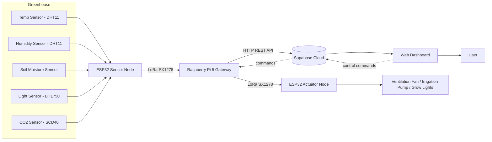

# 🌱 Smart Greenhouse Environment Monitoring and Control System

An IoT-based system that continuously monitors greenhouse environmental parameters (temperature, humidity, soil moisture, light intensity, CO₂) over a long-range **LoRa** link, logs the data to **Supabase**, and lets a **Raspberry Pi gateway** automatically or manually drive greenhouse actuators — a ventilation fan, an irrigation pump, and a grow light.

<p align="center">
  
  
  
  
</p>

---

## 📖 Abstract

Manual monitoring of greenhouse conditions is time-consuming and leads to inconsistent environmental control. This project automates that process end to end: an **ESP32 sensor node** reads temperature, humidity, soil moisture, light intensity, and CO₂ and transmits the readings over a long-range, low-power **SX1278 LoRa** link to a **Raspberry Pi gateway**. The gateway pushes the data to **Supabase** over REST APIs, drives an OLED status display, and polls Supabase for control commands, which it relays over LoRa to a second ESP32 **actuator node** that switches the fan, pump, and light via relays. A dashboard (designed in Figma) provides real-time visualization and manual override. Deep-sleep mode on the sensor node reduces power draw between readings, making the system suitable for low-cost, scalable, energy-efficient precision agriculture deployments.


## 🏛️ System Architecture



## ✨ Features

- **Multi-parameter monitoring** — temperature, humidity, soil moisture, light intensity, and CO₂, sampled by the sensor node and logged to Supabase.
- **Long-range, low-power link** — SX1278 LoRa (433 MHz, SF7, BW125, CR 4/5, CRC on) instead of Wi-Fi, for range and battery life suited to open greenhouse/farm areas.
- **Automatic + manual actuator control** — the gateway can trigger fan/pump/light based on threshold logic, or a user can issue a command from the dashboard, which is written as a row in the Supabase `commands` table.
- **Per-device command tracking** — each actuator (FAN/PUMP/LIGHT) tracks its own last-dispatched Supabase row ID, so repeated values (`ON` → `ON`) are never silently skipped.
- **ACK-based delivery confirmation** — the actuator node sends `ACK:<DEVICE>:<STATE>` back over LoRa after switching a relay.
- **Noise-tolerant framing** — commands are prefixed with a `....` marker; the actuator strips non-printable garbage before parsing, making the link tolerant of RF noise.
- **OLED live status display** — the gateway's SSD1306 screen shows live readings, actuator states, and RSSI for on-site debugging.
- **Power-efficient sensor node** — ESP32 deep sleep between reads cuts idle current from hundreds of mA to a few µA, enabling long battery-powered deployment.
- **Cloud dashboard** — real-time charts (min/max/average trends) and status indicators (High/Low/Normal) for each parameter, designed in Figma.

## 🔧 Hardware

| Node | Board | Radio | Sensors / Actuators |
|---|---|---|---|
| Sensor Node | ESP32 | SX1278 LoRa (433 MHz) | DHT11 (temp/humidity), BH1750 (light, I²C), soil moisture (analog), SCD40 (CO₂, I²C) |
| Gateway | Raspberry Pi | RFM9x LoRa module (433 MHz) | SSD1306 OLED display (I²C, 0x3C) |
| Actuator Node | ESP32 | SX1278 LoRa (433 MHz) | 3× relay → Fan, Grow Light, Irrigation Pump |

### Actuator node pinout

| Function | GPIO |
|---|---|
| LoRa SS | 5 |
| LoRa RST | 14 |
| LoRa DIO0 | 2 |
| Fan relay | 22 |
| Light relay | 21 |
| Pump relay | 15 |

> Relays are active-LOW: `HIGH` = off, `LOW` = on.

Greenhouse enclosure: ~20 × 15 × 15 in, built from acrylic sheets for a lightweight, transparent housing that simplifies sensor/actuator mounting and wiring access.

## 📡 LoRa radio configuration

Must match exactly on gateway and actuator:

| Setting | Value |
|---|---|
| Frequency | 433 MHz |
| Spreading factor | 7 |
| Signal bandwidth | 125 kHz |
| Coding rate | 4/5 |
| CRC | Enabled |

## 📨 Message protocol

**Sensor uplink** (sensor node → gateway), comma-separated `key:value` pairs:
```
Temp:25.3,Hum:60.1,Soil:512,Light:800,CO2:450
```

**Command downlink** (gateway → actuator), `....`-prefixed to separate real commands from RF noise:
```
....FAN:ON
....PUMP:OFF
....LIGHT:ON
```

**ACK uplink** (actuator → gateway):
```
ACK:FAN:ON
```

## ☁️ Supabase setup

Two tables back the system:

**`sensor_data`**
| column | type |
|---|---|
| temperature | float |
| humidity | float |
| soil_moisture | float |
| light_intensity | float |
| co2_level | float |
| created_at | timestamp (default `now()`) |

**`commands`**
| column | type |
|---|---|
| id | int / uuid (primary key) |
| command | text — one of `FAN:ON`, `FAN:OFF`, `PUMP:ON`, `PUMP:OFF`, `LIGHT:ON`, `LIGHT:OFF` |
| created_at | timestamp (default `now()`) |

To trigger an action (e.g. from the dashboard), insert a row:
```sql
insert into commands (command) values ('PUMP:ON');
```
The gateway polls the 10 most recent rows every `COMMAND_POLL_S` seconds, takes the latest row per device, and dispatches only rows it hasn't sent before.

## 📁 Repository structure

```
.
├── gateway.py        # Raspberry Pi: LoRa <-> Supabase bridge, command dispatch, OLED display
├── actuator.ino       # ESP32: LoRa receiver driving Fan / Light / Pump relays, sends ACKs
└── README.md
```
> The ESP32 **sensor node** firmware (DHT11/BH1750/soil/SCD40 read + LoRa transmit + deep sleep) is part of the deployed system described in the project report but is not yet included in this repository — add it here when available.

## ⚙️ Configuration

In `gateway.py`:
```python
SUPABASE_URL = "https://<your-project>.supabase.co"
SUPABASE_KEY = "<your-anon-key>"

COMMAND_POLL_S    = 3.0   # how often to check Supabase for new commands
DISPLAY_UPDATE_S  = 2.0   # how often to refresh the OLED
```

> ⚠️ **Security:** don't commit real Supabase keys to a public repo. Load them from environment variables (e.g. `python-dotenv`) and add `.env` to `.gitignore`. Rotate any key that has already been pushed to a public repository.

## ▶️ Running the gateway

```bash
pip install adafruit-circuitpython-rfm9x adafruit-circuitpython-ssd1306 pillow requests
python3 gateway.py
```

## 📤 Flashing the actuator node

1. Open `actuator.ino` in the Arduino IDE / PlatformIO.
2. Install the `LoRa` library (Sandeep Mistry).
3. Select your ESP32 board and port, then upload.
4. Open Serial Monitor at `115200` baud to watch received commands, relay state, and RSSI.

## 🖥️ Dashboard

A Figma-designed web dashboard provides:
- Real-time numeric + graphical display of all five environmental parameters, with High/Low/Normal status labels
- Historical trend charts (min/max/average) for soil moisture, light, temperature, and humidity
- Navigation sections: Dashboard, Analytics, Controls, Alerts
- Manual actuator control (writes directly to the Supabase `commands` table)

## 🧪 Results

- Stable, packet-loss-free LoRa communication was observed between the sensor node and gateway during testing, with RSSI monitored to validate link quality and antenna placement.
- The actuator node was successfully expanded from fan-only control to fan + pump + light, with ACK-confirmed delivery for each command.
- Deep sleep on the sensor node reduced idle current from hundreds of mA to a few µA between sampling cycles.

## 🚀 Future Scope

- Additional sensors: pH, nutrients, advanced gas sensing
- Machine learning for predictive environmental control
- Native mobile app with real-time push alerts
- Solar power for fully off-grid, sustainable operation
- Scaling to multi-node, large-area precision agriculture deployments

## 📚 References

1. Augustin, A., Yi, J., Clausen, T., & Townsley, W. M. (2016). A Study of LoRa: Long Range & Low Power Networks for the Internet of Things. *Sensors*, 16(9), 1466.
2. Bicamumakuba, E. et al. (2021). Internet of Things and LoRaWAN for smart agriculture: A review. *Computers and Electronics in Agriculture*.
3. Centenaro, M., Vangelista, L., Zanella, A., & Zorzi, M. (2016). Long range communications in unlicensed bands. *IEEE Wireless Communications*, 23(5), 60–67.
4. Jawad, H. M., Nordin, R., Gharghan, S. K., Jawad, A. M., & Ismail, M. (2017). Energy Efficient Wireless Sensor Networks for Precision Agriculture: A Review. *Sensors*, 17(8), 1781.
5. Mezouari, A. et al. (2023). LoRaWAN-based intelligent multi-greenhouse monitoring and control platform. *E3S Web of Conferences*.
6. Patil, K. A., & Kale, N. R. (2016). A model for smart agriculture using IoT. *ICGTSPICC*.
7. Putra, S. D. et al. (2022). Design of IoT Monitoring System Based on LoRaWAN Architecture for Smart Green House. *IOP Conf. Series: Earth and Environmental Science*, 1012, 012090.
8. Tzounis, A., Katsoulas, N., Bartzanas, T., & Kittas, C. (2017). Internet of Things in agriculture, recent advances and future challenges. *Biosystems Engineering*, 164, 31–48.
9. ur Rehman, A. et al. (2022). Smart greenhouse monitoring system using IoT and wireless sensor networks. *IJACSA*.
10. Zhang, Y. et al. (2020). Carbon dioxide monitoring and control in greenhouse cultivation: A review. *Biosystems Engineering*.

### Component datasheets
- [BH1750 light sensor](https://rohmfs.rohm.com/en/products/databook/datasheet/ic/sensor/light/bh1750fvi-e.pdf)
- [Soil moisture sensor](https://components101.com/sites/default/files/component_datasheet/Soil-Moisture-Sensor-Datasheet.pdf)
- [SCD40 CO₂ sensor](https://sensirion.com/media/documents/48C4B7FB/6165371E/Sensirion_CO2_Sensors_SCD4x_Datasheet.pdf)
- [ESP32](https://www.espressif.com/sites/default/files/documentation/esp32_datasheet_en.pdf)
- [SX1278 LoRa module](https://www.semtech.com/uploads/documents/sx1276_77_78_79.pdf)
- [Raspberry Pi 4](https://datasheets.raspberrypi.com/rpi4/raspberry-pi-4-datasheet.pdf)
